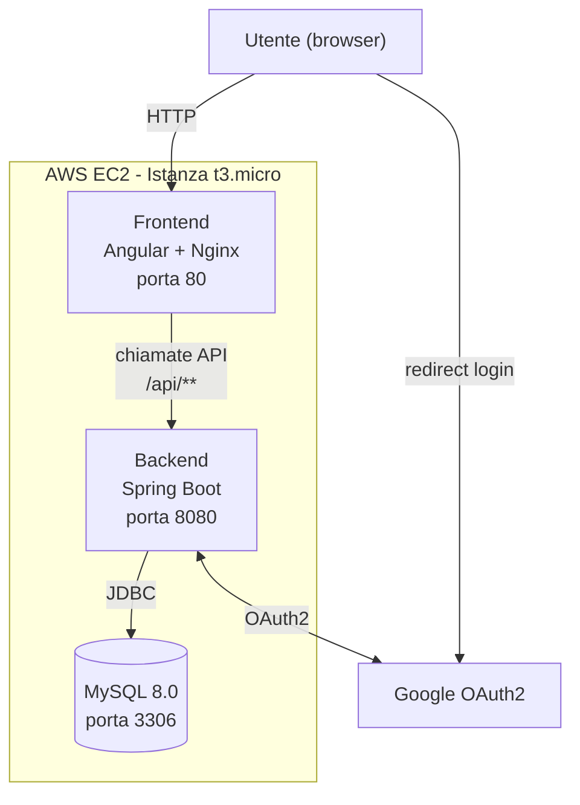

# HackHub – progetto universitario di gruppo

HackHub è una piattaforma per la gestione degli hackathon, che riunisce in un unico spazio virtuale organizzatori e partecipanti, permettendo ai primi di
pubblicare edizioni di eventi, valutare i progetti, sanzionare eventuali condotte scorrette e pubblicare classifiche, e ai secondi di partecipare in team.
La piattaforma non esclude la possibilità che un utente possa essere sia membro di staff per alcuni hackathon, che partecipante per altri.
Il progetto è stato implementato per due esami:

- **Ingegneria del Software** – [Curzi, Lattanzi, Temon].
  Partendo da un’analisi dei requisiti forniti dai professori, tramite l’applicazione del Processo Unificato è stata progettata la piattaforma in locale
  con diverse funzionalità. Il progetto è stato in seguito presentato tramite chiamate Postman.
- **Applicazione Web Mobile e Cloud** – [Curzi, Temon].
  Sfruttando la base pregressa, il progetto è passato da locale ad applicazione web e cloud, sfruttando le tecnologie apprese durante il corso.
  
Una demo è disponibile al link http://35-181-19-124.sslip.io.

## Funzionalità implementate
-	**Autenticazione tramite OAuth2 Google**: per motivi di sicurezza è stato scelto di delegare la gestione dell’autenticazione a Google. Essendo il progetto
  di tipo universitario, si è optato per usare il dominio interno dell’università. Pertanto, non sono permessi accessi che non appartengano a @unicam.it. 
-	**Gestione degli hackathon**: qualora l’utente avesse il permesso come membro di staff, potrà creare, modificare e gestire un hackathon, visualizzando lo
  stato dell’evento ed i team iscritti.
-	**Gestione dei team**: ogni utente può iscriversi ad uno ed un solo team, eventualmente creandone uno. Potrà invitare altri utenti ad unirsi, iscrivere
  il team ad un hackathon e caricare gli elaborati necessari alla valutazione per gli stessi.
-	**Gestione degli elaborati**: i file caricati vengono salvati su un server e associati al team. Gli utenti che sono membri di staff dell’hackathon
  corrispondente possono scaricare i progetti, così da poterli visionare e/o valutare.
-	**Gestione degli inviti**: gli utenti possono accettare o rifiutare gli inviti ricevuti nella sezione dedicata. Un organizzatore può invitare altri
  utenti a partecipare all’hackathon come giudice o come mentore, mentre un membro di un team può invitare un altro utente ad unirsi al gruppo.

## Architettura generale e tecnologie usate
L’architettura di HackHub è organizzata secondo una chiara separazione tra frontend, backend e infrastruttura di deploy, così da garantire
modularità, manutenibilità e una gestione coerente dei diversi livelli dell’applicazione. La progettazione è stata guidata dai modelli UML
sviluppati in Visual Paradigm, che hanno permesso di definire in anticipo entità, relazioni, vincoli e flussi principali del sistema tramite
il procedimento iterativo dato dal Processo Unificato.

### Separazione frontend–backend
La piattaforma è suddivisa in due componenti indipendenti:
- un **backend REST** sviluppato in Java v21 utilizzando Spring Boot v3.2.0. Il database utilizzato è MySQL v8.0, mentre nei test viene
impiegato H2 come database in-memory. La build del backend è gestita tramite Gradle 8.5, con script in Kotlin DSL, scelta che garantisce
maggiore tipizzazione e integrazione con IntelliJ;
- un **frontend SPA** sviluppato in Angular v18.2. La build viene eseguita tramite Node.js v20 e servita da Nginx all’interno di un
container Docker dedicato, che espone i file statici dell’applicazione.

### Infrastruttura – Docker e deploy su EC2
Il deploy dell’applicazione avviene su una istanza t3.micro, con server Ubuntu, di AWS EC2, dove i componenti vengono eseguiti tramite Docker.
In particolare, il backend gira come container Java (runtime Eclipse Temurin 21), mentre il frontend viene distribuito da Nginx all’interno del proprio
container.

Maggiori informazioni tecniche sull’istanza di EC2:
-	 ha uno storage di 20 GiB (EBS), aumentato dal default di 8 GiB così da permettere la build delle immagini Docker;
-	Swap di 2 GB configurati manualmente per compensare la RAM limitata di 1 GB durante ‘npm install’;
-	IP fisso;
-	Security group: ha tre porte aperte, ovvero 22 (SSH), 80 (per frontend), 8080 (per backend).

Inoltre, sono state adottate le seguenti configurazioni specifiche per l’ambiente cloud:
- CORS: l'indirizzo pubblico dell'istanza è stato aggiunto alle origini autorizzate;
- L'URL del backend nel frontend viene calcolato dinamicamente a runtime
  (`window.location.hostname`), così che la stessa immagine Docker funzioni sia
  in locale sia in cloud senza ricompilare;
- l’indirizzo pubblico è stato inserito tra gli OAuth2 redirect URI autorizzati su Google Cloud Console.

### Pipeline CI/CD
La pipeline di integrazione continua è gestita tramite GitHub Actions, che esegue automaticamente la build del backend tramite Gradle, l’esecuzione dei test ed il deploy su EC2 via SSH, solo qualora i test avessero esito positivo, riavviando i container.
Questa infrastruttura permette di mantenere un ambiente di deploy riproducibile e coerente, riducendo gli errori manuali e garantendo un flusso di lavoro coerente con le metodologie DevOps.

 ### Strumenti di progettazione
Durante la fase di analisi e progettazione sono stati utilizzati:
•	**Visual Paradigm** per la modellazione UML,
•	**IntelliJ IDEA** per lo sviluppo Java,
•	**Postman** per il testing delle API,
•	**Docker Compose** per la gestione dei container.

## Scelte progettuali
Lo sviluppo di HackHub è stato guidato da scelte progettuali che mirano a garantire chiarezza architetturale, scalabilità e coerenza con i principi del cloud computing. Alcune decisioni sono state implementate, mentre altre sono state analizzate come possibili estensioni future, per avere consapevolezza dei trade-off architetturali.

### Autenticazione delegata a Google OAuth2
Per evitare la gestione diretta di password e sessioni, l’autenticazione è stata delegata a Google OAuth2, così da garantire maggiore sicurezza e l’integrazione nativa con Spring Security. Data la natura universitaria del progetto, come precedentemente accennato, si è voluto limitare l’accesso al dominio universitario. Come indicato dalle best-practice, le credenziali e i secret di Google OAuth2 sono identificate come secrets, e collocate in file che github e docker ignorano.

### Frontend – Angular
Il frontend è realizzato con Angular v 18.2, sfruttando:

- componenti modulari;
- routing client-side;
- integrazione diretta con API REST.

La separazione tra backend e frontend consente un deploy indipendente, maggiore manutenibilità e la possibilità di scalare i componenti in modo autonomo.

### Backend – Spring Boot
Il backend è sviluppato in Java v21 utilizzando Spring Boot v 3.2.0, che fornisce un ecosistema integrato per:

- esposizione di API REST;
- gestione della sicurezza tramite Spring Security;
- persistenza con JPA/Hibernate;
- validazione dei dati;
- configurazione centralizzata tramite file .properties.

La logica applicativa è suddivisa in livelli distinti:

- **Controller**: gestiscono le richieste HTTP e producono risposte JSON;
- **Handler**: orchestrano i casi d’uso e coordinano i servizi;
- **Service**: implementano la logica di dominio;
- **Repository**: gestiscono l’accesso al database tramite JPA.

Il database utilizzato è MySQL v8.0, mentre nei test viene impiegato H2 come database in-memory.

### Persistenza tramite JPA/Hibernate
La persistenza è gestita tramite JPA/Hibernate, che permette un mapping automatico delle entità e la gestione delle relazioni.
In locale viene utilizzato H2, al fine di velocizzare i test, mentre in produzione è stato adottato MySQL, per garantire la persistenza una volta spenta la singola istanza su cui si stava lavorando. Questa suddivisione permette di distinguere concettualmente i due ambienti, di sviluppo e di produzione. 

### Applicazione stateless
Il backend è progettato come stateless, con lo stato persistente gestito nel database. Questo approccio facilita la scalabilità orizzontale, con deploy su più istanze, e riduce i vincoli legati alla sessione.
Lo stato dell’utente (ruolo, team di appartenenza, permessi) viene recuperato tramite OAuth2 e interrogazioni al database, senza mantenere sessioni server-side.

### Containerizzazione con Docker
L’intera applicazione è eseguita tramite Docker:
- il backend utilizza un’immagine Java ottimizzata (Temurin JRE Alpine);
- il frontend viene servito da Nginx all’interno del proprio container.
Questa scelta garantisce isolamento dell’ambiente e riproducibilità del deploy, permettendo inoltre di applicare diversi pattern di scalabilità dove più consono.

### Scalabilità orizzontale 
Sebbene il progetto sia stato deployato su una singola istanza EC2, in linea teorica è stata valutata la possibilità di scalare orizzontalmente, usando:
- più istanze del backend dietro un load balancer;
- frontend servito come file statici replicabili;
- database distribuito.

Sono stati analizzati diversi pattern di scalabilità del database: il **pattern read replicas** è stato escluso, poiché il carico previsto è principalmente
in scrittura. Si è optato per il pattern **sharding** del database per la distribuzione dei diversi hackathon, usando l’ID dell’hackathon come chiave di
partizionamento.

Per la gestione della scalabilità si è scelto di integrare l’**autoscaling reattivo** con lo **scaling predittivo**, quest’ultimo attivato in prossimità
delle scadenze delle consegne, sulla base del numero di team iscritti. Inoltre, in via preventiva, è possibile accendere più istanze per gli hackathon in
fase di svolgimento.

Questi elementi non sono stati implementati, ma sono stati considerati per ottenere una maggiore consapevolezza della progettazione futura. Ottimale sarebbe
automatizzare la scalabilità tramite un sistema di orchestrazione come Kubernetes.

## Istruzioni di Build & Run

### In cloud
Come anticipato, il progetto è accessibile al link http://35-181-19-124.sslip.io, in quanto già deployato su cloud.

### In locale
Qualora si volesse deployare il progetto in locale, di seguito sono elencati i passaggi da eseguire.

#### Setup dell'ambiente
  1.  Prerequisito fondamentale è avere versioni compatibili con quelle del progetto. In particolare si consiglia di usare:
     
          |   Componente   | Versione |
           
          |----------------|----------|
          
          | Java           | 21       |
          
          | Spring Boot    | 3.2.0    |
        
          | Gradle         | 8.5 (gestito tramite wrapper `./gradlew`, non richiede installazione separata) |
        
          | Node.js        | 20       |
         
          | Angular        | 18.2     |
         
          | MySQL          | 8.0      |
         
          | Docker Compose | v2+ (plugin "docker compose", non il vecchio "docker-compose") |
       Qualora non fossero presenti, procedere con l'installazione degli stessi.

   3. Clonare il repository
      
      Il passaggio è facilmente eseguibile tramite il comando:

          git clone https://github.com/Sterrestre/HackHub_Curzi-Lattanzi-Temon_2025-26.git
      
          cd HackHub_Curzi-Lattanzi-Temon_2025-26

  4. Configurare le variabili d'ambiente
     
       Per motivi di sicurezza il progetto non contiene credenziali hard-coded. Tutta la
       configurazione sensibile è esterna, tramite un file `variabili.env` nella root del progetto.
       Tale file è stato precedentemente inviato tramite mail ai docenti interessati. Qualora si volesse
       ottenere il file, è possibile richiederlo alle titolari della repository. Si ricorda di salvare il
       file in locale nella cartella corretta.

#### Build & Run - avvio completo con Docker Compose
Con Docker Desktop avviato, dalla root del progetto:

    docker compose --env-file variabili.env up --build

Questo comando:
- builda l'immagine del backend (Spring Boot, multi-stage: Gradle → JRE)
- builda l'immagine del frontend (Angular, multi-stage: Node → Nginx)
- avvia un container MySQL con healthcheck
- collega i tre servizi in un'unica rete Docker, avviando il backend solo dopo che MySQL è pronto.

Al termine, l'applicazione è raggiungibile su:
- Frontend: `http://localhost`
- Backend (API): `http://localhost:8080/api/...`

Per fermare tutto: `Ctrl+C`, poi `docker compose down` (i dati del database restano salvati in un volume persistente).

#### Build del backend - senza Docker
Richiede un MySQL raggiungibile su `localhost:3306` (es. avviato a parte con `docker run` o installato localmente), con le stesse credenziali indicate in `variabili.env`.
Dal terminale, all'interno della root del progetto, lanciare i comandi:

    ./gradlew build
    
    ./gradlew bootRun

Le variabili d'ambiente vanno esportate nell'ambiente della shell, o configurate nella Run Configuration dell'IDE (IntelliJ: Edit Configurations → Environment Variables).

#### Build del frontend - senza Docker
Eseguire i seguenti comandi:

    cd hackhub-frontend
    
    npm install
    
    npm start

Il frontend si avvia in modalità sviluppo su `http://localhost:4200`, con un proxy (`proxy.conf.json`) che inoltra automaticamente le chiamate `/api/**`, `/oauth2/**` e `/login/**` verso il backend su `localhost:8080` — necessario per evitare i limiti dei browser sui cookie di sessione tra origini diverse.

Per una build di produzione:

    npm run build

#### Popolamento del database
Lo schema del database viene creato **automaticamente** all'avvio (Hibernate, `spring.jpa.hibernate.ddl-auto=update`) — non serve eseguire script SQL manuali.

Non esiste attualmente uno script di dati di esempio (seed): il database si popola usando l'applicazione stessa, ad esempio:
1. Effettuare il login con Google usando la mail universitaria del dominio @unicam.it (crea automaticamente l'utente nel database)
2. Creare un hackathon dal frontend (form "Crea hackathon")
3. Confermare l'hackathon (pulsante "Conferma hackathon", visibile all'organizzatore)
4. Iscrivere un team, caricare una sottomissione, ecc., seguendo il flusso normale dell'applicazione

In alternativa, è possibile usare direttamente le API REST (es. con Postman) per popolare dati di test più rapidamente.

## Diagrammi

### Architettura di deployment

I diagrammi UML dettagliati (classi, casi d'uso, sequenza) realizzati con
Visual Paradigm durante la fase di analisi sono disponibili nella cartella
[`VisualParadigm/`](./VisualParadigm) del repository.

## Limiti e future estensioni
Nonostante la piattaforma sia pienamente funzionante nelle sue componenti principali, alcune funzionalità non sono state implementate o sono state semplificate per rispettare i vincoli temporali del progetto. Sono state tuttavia analizzate diverse possibili evoluzioni architetturali, in particolare legate ai temi del cloud computing e dell’orchestrazione dei container.

### Passaggio completo a HTTPS
Il progetto è stato consegnato con comunicazione HTTP per ridurre la complessità del deploy. Una futura evoluzione potrebbe prevedere:
- Nginx su EC2, integrando un reverse proxy;
- certificati Let’s Encrypt;
- redirect automatici;
- integrazione sicura con OAuth2.

Questo passaggio è fondamentale per integrare l’API di Gmail, permettendo di inviare automaticamente le mail da un indirizzo identificabile come
"HackHub Support Team". Si specifica che il progetto è predisposto a questo cambiamento, avendo già identificato nella classe `MailSenderConfig.java`
il profilo dev e prod, così da distinguere in modo pulito i due ambienti e non inviare email in fase di progettazione.

### Orchestrazione
Una possibile futura estensione è quella di integrare un sistema di orchestrazione come Kubernetes per implementare in modo automatico lo scaling predisposto descritto in [Scalabilità orizzontale](#scalabilita-orizzontale).
